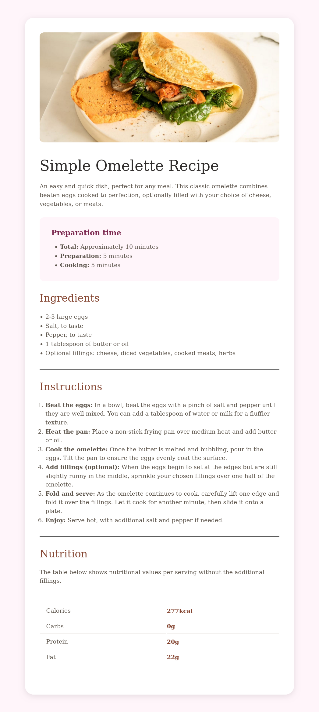

# Frontend Mentor - Recipe page solution

This is a solution to the [Recipe page challenge on Frontend Mentor](https://www.frontendmentor.io/challenges/recipe-page-KiTsR8QQKm). Frontend Mentor challenges help you improve your coding skills by building realistic projects. 

## Table of contents

- [Overview](#overview)
 
  - [Screenshot](#screenshot)
  - [Links](#links)

- [Author](#author)

## Overview

### Screenshot

### Links

- Solution URL: [https://github.com/CoderAlchemy24/recipe-page.git](https://github.com/CoderAlchemy24/recipe-page.git)
- Live Site URL: [https://frme-recipe-page.netlify.app](https://frme-recipe-page.netlify.app)

## Author

- Website - [@CoderAlchemy24](https://frme-recipe-page.netlify.app/)

